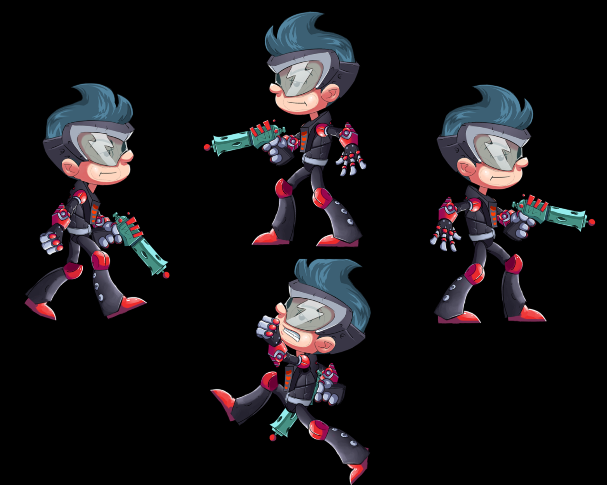

# Spineboy Adventure Game 🎮

## Overview 🌈
This project is a 2D side-scrolling platformer featuring "Spineboy," developed using PixiJS and Spine animation. The game showcases smooth animation transitions, responsive keyboard controls, and basic physics for a fun and interactive gaming experience. Direct preview of the game can be found here https://codesandbox.io/p/sandbox/spineboy-project-d4vw2f?file=%2F.prettierrc%3A11%2C2. 

## Technologies Used
- PixiJS for rendering the game canvas and animations.
- Spine for creating and integrating complex animations.
- Howler.js for sound effects.
- JS

## Features
- Animated character "Spineboy Pro" with idle, walking, and jumping animations.
- Keyboard controls for movement (left/right arrow keys) and jumping (spacebar).
- Smooth transitions between animations based on player interactions.
- Horizontal movement and simple physics for realistic jumping and landing.
- (Optional) Sound effects for enhanced gameplay experience.

## Setup and Installation
1. Clone the repository: `git clone this repo`
2. Navigate to the project directory: `cd ts-spineboy-character`
3. Install the Magic: `npm i`
4. Run the game: `npm start`

## How to Play 🕹️
- Use the left and right arrow keys to move Spineboy.
- Press the spacebar to make Spineboy jump.
- The game loop handles animation transitions and physics automatically.

